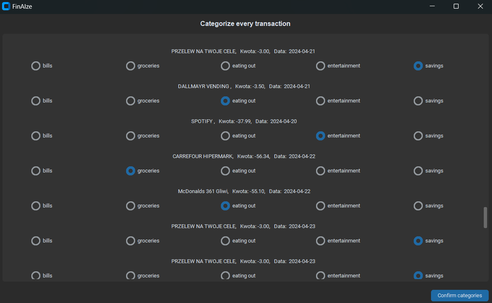
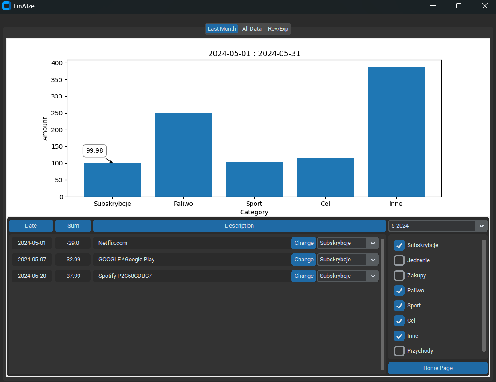

# FinAIze
FinAIze is an app for analyzing finances which uses AI to categorize transactions.

App makes analyzing finances easier and faster. You don't need to input everything manually to excel anymore. App accepts bank statements in pdf format and automatically extracts from them necessary data. Then user can decide how many categories to divide transactions into. 

The first time user needs to categorize every transaction himself, then baised on that information an AI model is trained.

Next time, adding data for the next period, the AI model is used to categorize transactions and user only needs to verify 15% of transactions that were categorized with the least certainty. 

User can view data in the charts.

